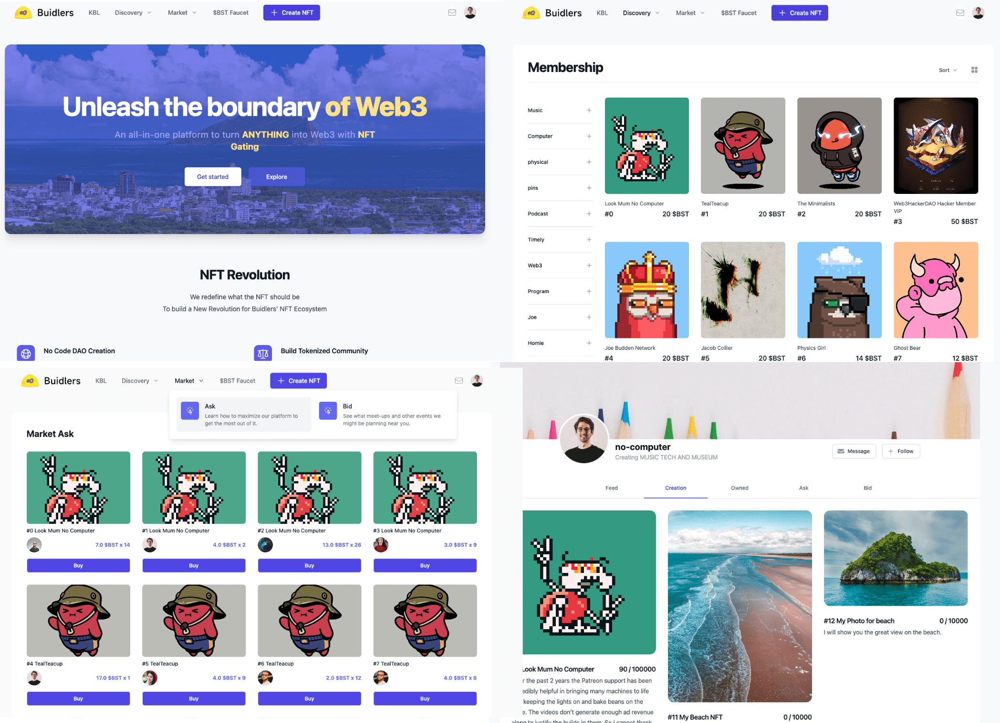
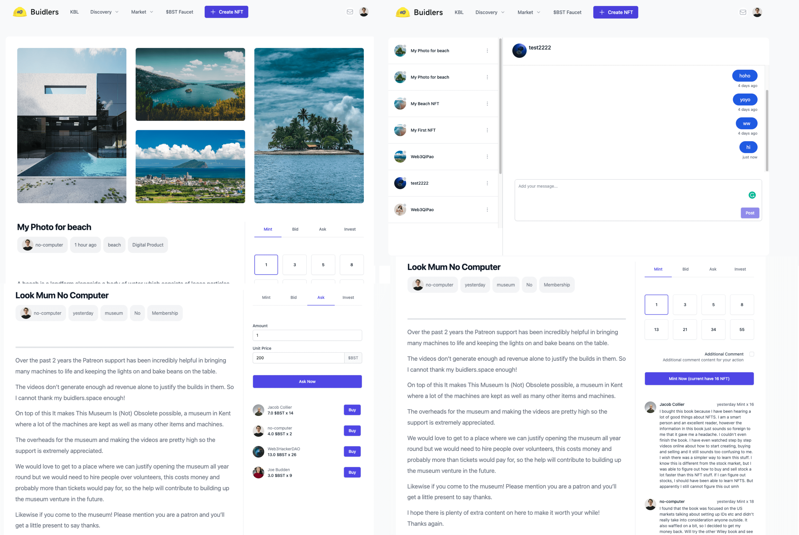
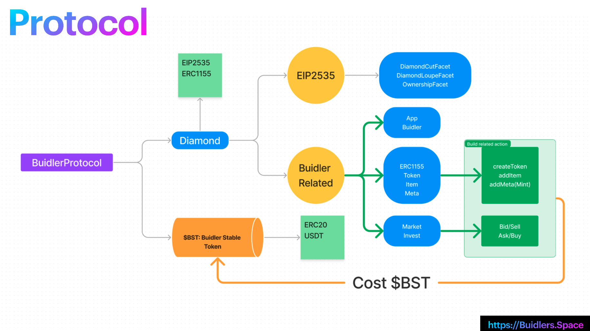

# Buiders.Space All in one web3 NFT space

The all-in-one web3 space for Creators & Brands with NFT create/mint/trade/token gating/De-Social features.

A multiple chain supported nft space that can create/trade/buy/bid/ask NFT stuff!

A web3 way of creater space that like a web3 App Store!

The contract address we deploy to FIL  calibration testnet

https://calibration.filfox.info/en/address/0xd7f8fD88193BBd31beF70C52519A71F756F0F85C

bstSwapAddress: '0x460b8a86E18AE175de3f22A0B3260d327B79FeD5'

bstEntropyAddress: '0xc3A318A38B1C15f04Fc8dDc7ec48246476736236'

BuidlerProtocol: '0xd7f8fD88193BBd31beF70C52519A71F756F0F85C'

As LitProtocol do not provide the calibration net support yet, we do not provide the LIT action demo.
But while we launch on FIL mainnet, we can support it too(as Lit Protocol support FIL mainnet now)!

## Links

* Overview Video: <https://www.loom.com/share/16793404274444bf84e55519febfa112>
* Create NFT Video: <https://www.loom.com/share/13f970f0b2024a6fbcfcc99bdd3dd23b>
* Create Item Video: <https://www.loom.com/share/59679a7ac5794516ba520fe1d2521ce0>
* Mint / Bid / Ask / Unlock Item Video: <https://www.loom.com/share/2c8a711b3ab949558913018d26adf4bb>
* Online demo
  * Mumbai
    * demo: <https://www.buidlers.space>
    * contract: <https://mumbai.polygonscan.com/address/0x3Efb3F8F64e8C62594Ff02866a07e63e576436Fd>
  * BSC Testnet
    * demo: <https://bsctestnet.buidlers.space/bscTestnet/buidlers/build/18>
    * contract: <https://testnet.bscscan.com/address/0x268ab9c820c94c18ac8293e2e239bf0af1bd8f91>
* [All screenshots](./screenshots/)
* [Pitch Deck](./buidlers-space.pdf)

## Problem

NFT should have value on it not just PFP. We create the super great Smart Contract BuidlerProtocol that treats it as the center of the Builders! Every builders can create many builds for themself for any project(every project is an NFT).

Builder will continue to add new build on the NFT, so their users(buyer) can mint NFT(buy it with $NST), then can sell it or make an Ask order, and the guy does not mint the NFT can buy NFT from the de-market or just make a new Bid for the NFT.

When builders add a new build for his/her NFT projects, they need to add the cidRaw and size, so later the SP can call activateDealBySP to activate the deal, then call the withdrawReward with cidRaw to get the reward.

* A lot of NFT lists on OpenSea/X2Y2 with different contracts and data flow
* Users fall into lots of Ponzi projects without value
* Launch a DAO require a lot of complicated tech stuff to use for Web2 users
* There is no standard no-tech token gating solution for Web2 users yet
## Opportunity

Getting producers and consumers together all to web3 in a unified verse can help the productive economic more decentral
While taking a very tiny transaction friction fee can be incredibly profitable as more users join in

## Features

* user home page(show primary ProfileID from the address) with post, comment and essenceNFT collected that can follow:  <https://bsctestnet.buidlers.space/bscTestnet/buidlers/user/0xC6E58fb4aFFB6aB8A392b7CC23CD3feF74517F6C/feed>
* NFT (create a new profileID to attached to while create new NFT) with cyberconnect Post, comment and follow: <https://bsctestnet.buidlers.space/bscTestnet/buidlers/build/13>
* a demo essenceNFT connected with token gating, lit action and livepeer content: <https://bsctestnet.buidlers.space/bscTestnet/buidlers/build/13/10>
* We have the $BST(Buidler Stable Token) faucet not for user to test
* User can update their profile, check their social home page with Feed(get data from lens) / Creation / Bid order / Ask order
* On the KBL page, we can see the user list currently already add on to the chain
* Click on the user's avatar can get to the user's home page
* Creators/Producers can create an new ERC1155 NFT as their project
  * Also create a new Web3MQ chat group at the same time to bind on this NFT
* Creator can create new item for this NFT with token gating condition
* Consumers can mint NFT to access the token gating content with this NFT
* User can bid/ask of the NFT
* User can sell/buy order in the nft market
* User can click on the top right email btn to go to the Web3MQ Chat dashboard to see all of the Channel they have

## Technologies I used

* EIP2535
* ERC1155
* Vue3
* Hardhat
* TailwindCSS
* WindiCSS
* PWA
* IPFS(nft.storage)
* Vercel

## Challenges I ran into

While develop the `BuidlerProtocol` contract, it has so many function that it exceed the 24KB size limit.
Then we find out the greate `EIP2535` that help us to build unlimited size of our contract code.

## Have you validated the problem you are attacking and/or the solution?

We can see a lot of web2 brands try to involved into web3, that's why we believe it's time to push the market forward by us

### EIP2535 to build large contract <https://eips.ethereum.org/EIPS/eip-2535>

Our contract is large, so we use the Diamond Tech to build our smart contract: use the diamond cut func to deploy more facts: <https://github.com/NftTopBest/buiders-space-fevm-lighthouse/blob/main/contracts/DiamondCutFacet.sol>
